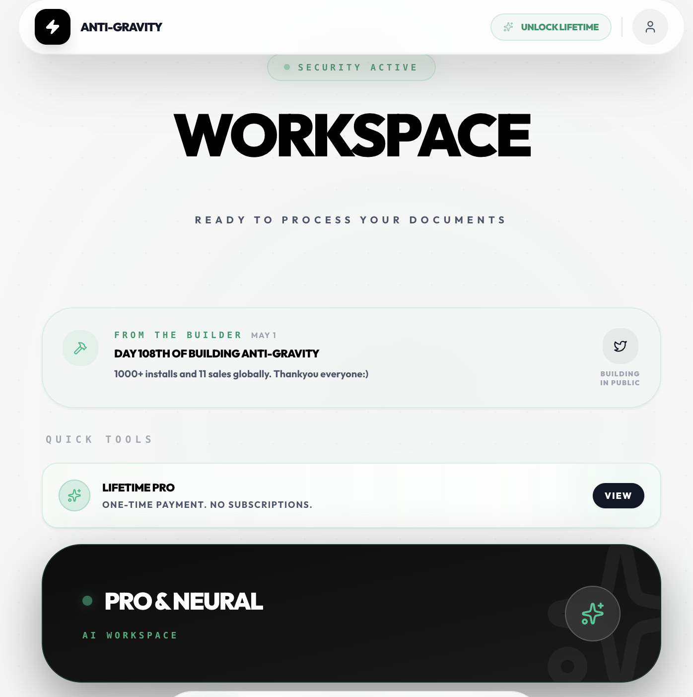
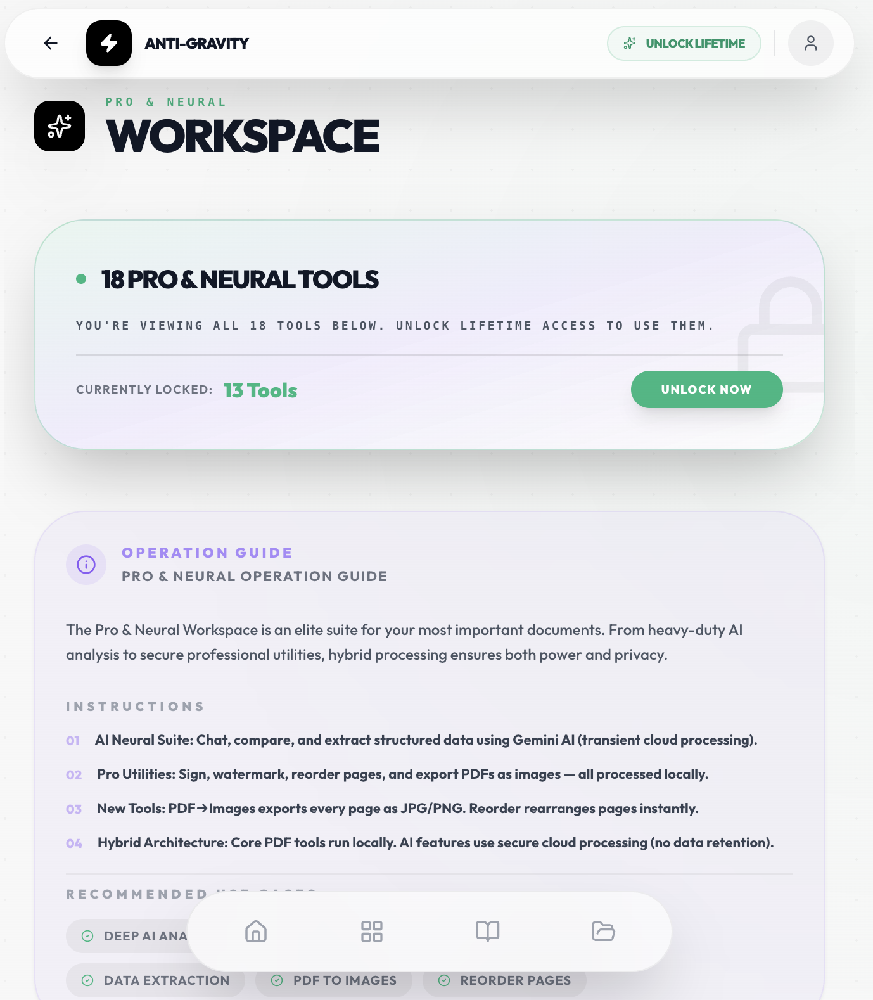
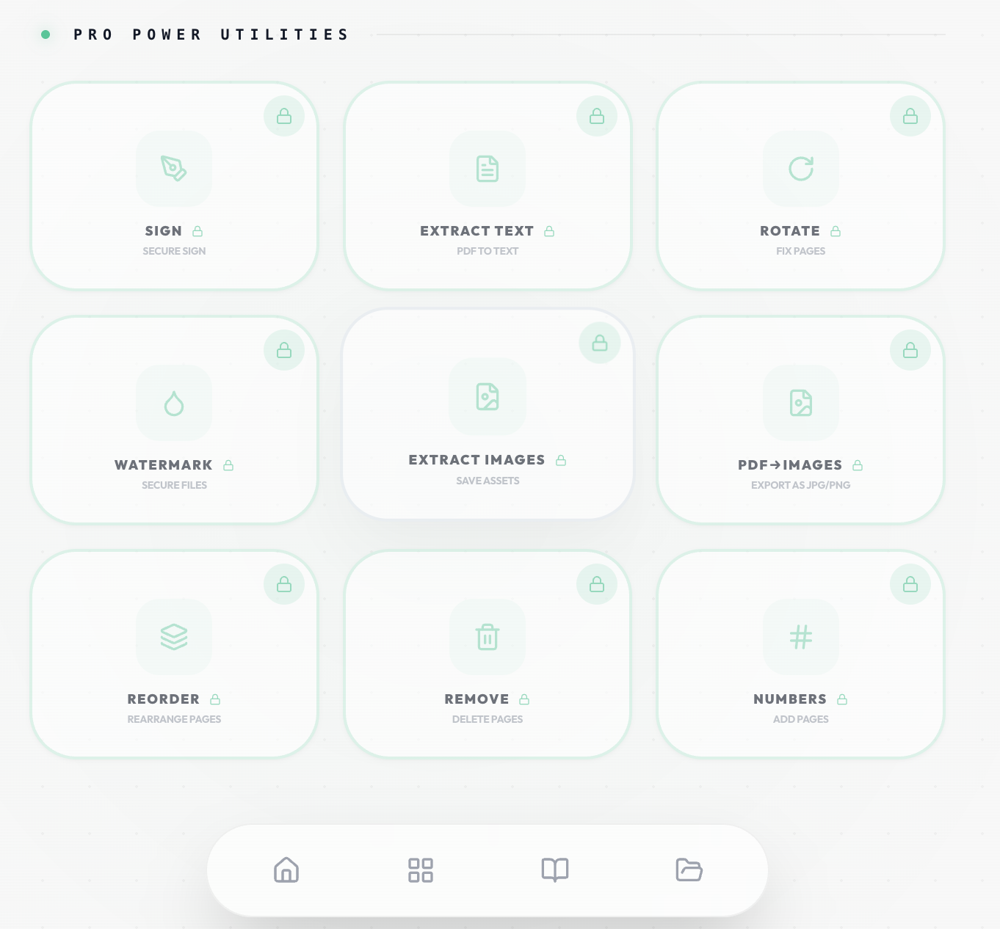
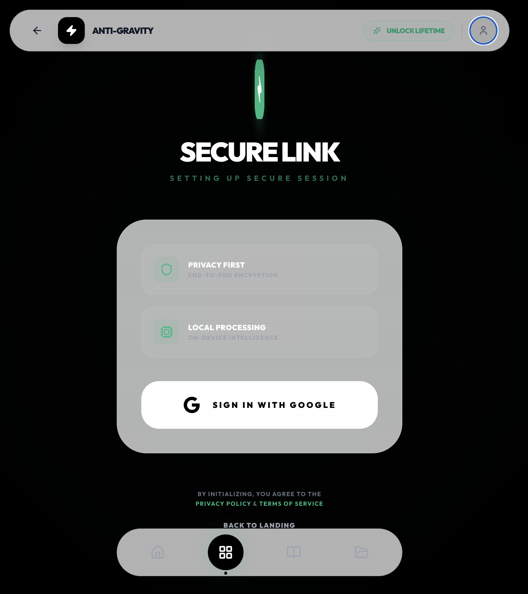

# Anti-Gravity

Private AI PDF toolkit for Android and web. Anti-Gravity combines local-first PDF utilities with Gemini-powered document analysis, so users can read, chat with, extract from, and edit important documents without subscriptions or ads.

[Live Web App](https://pdf-tools-pro-indol.vercel.app) | [Play Store](https://play.google.com/store/apps/details?id=com.cryptobulla.antigravity)

## Screenshots









## What It Does

- Chat with PDFs using Gemini AI
- Summarize documents and ask follow-up questions
- Extract structured data from PDFs, scans, invoices, and receipts
- Compare document versions with AI assistance
- Redact sensitive information with AI-assisted workflows
- Merge, split, rotate, sign, watermark, reorder, and remove PDF pages
- Convert images to PDF and export PDF pages as images
- Extract text and images from PDF files
- View PDFs with reader, chat, outline, and mind-map modes
- Use one-time lifetime access instead of a subscription model

## Privacy Model

Anti-Gravity uses a hybrid architecture:

- Core PDF utilities run locally where possible.
- AI features send document context through a signed server proxy to Gemini.
- The Gemini API key stays on the server and is never shipped to the client.
- Document content is not intentionally stored by the app backend after AI processing.
- Google auth, Supabase, and server-side usage tracking are used for account, access, and limit management.

Do not describe the app as fully offline or 100% local for AI features. Gemini-backed workflows require cloud processing.

## API Costs & Performance

- Gemini-powered features can create API costs based on document size and usage volume.
- Large PDFs increase text extraction time, memory usage, and AI token consumption.
- Scanned PDFs may require image rendering before AI analysis, which is slower than text-based PDFs.
- PDF.js workers are bundled locally for WebView compatibility, but CMap/font assets may still use CDN fallbacks.
- Server-side rate limiting and usage tracking are part of the cost-control layer.

## Architecture

```txt
React + TypeScript + Vite frontend
        |
        | Capacitor Android shell
        |
        v
Node.js / Express server proxy
        |
        | HMAC-signed AI requests
        | JWT/session validation
        | Play Integrity checks on Android
        | Rate limiting and usage tracking
        v
Gemini API

Supabase stores auth/session/usage data.
RevenueCat-style native purchase handling manages lifetime access.
```

## Tech Stack

| Layer | Technology |
| --- | --- |
| Frontend | React 19, TypeScript, Vite 7, Tailwind CSS |
| Mobile | Capacitor 8, Android |
| PDF processing | pdf-lib, PDF.js, react-pdf |
| AI | Gemini via server-side proxy |
| Backend | Node.js, Express |
| Auth/data | Google OAuth, Supabase |
| Payments | Native in-app purchase flow |
| Deployment | Vercel |

## Project Structure

```txt
src/
  components/   Shared UI components
  screens/      App screens and PDF tools
  services/     Auth, AI, billing, analytics, API clients
  utils/        PDF, image, validation, logging helpers

server/         Express proxy for AI and backend operations
api/            Vercel API routes
android/        Capacitor Android project
public/         Static assets, PDF workers, screenshots
docs/           Setup, security, migration, and deployment notes
```

## Local Development

Prerequisites:

- Node.js 22+
- npm 10+
- Android Studio, only for Android builds

Install dependencies:

```bash
npm install
cd server
npm install
cd ..
```

Create a local environment file from `.env.example`:

```env
VITE_GOOGLE_CLIENT_ID=your_google_client_id
VITE_AG_PROTOCOL_SIGNATURE=your_protocol_signature
VITE_SUPABASE_URL=your_supabase_url
VITE_SUPABASE_ANON_KEY=your_supabase_anon_key
RESEND_API_KEY=your_resend_api_key
OWNER_EMAIL=your_email
RESEND_FROM_EMAIL=onboarding@resend.dev
GEMINI_API_KEY=your_gemini_api_key
```

Run the frontend:

```bash
npm run dev
```

Run the server:

```bash
cd server
npm start
```

## Android Build

```bash
nvm use 22
npm run build
npx cap sync android
```

Then open `android/` in Android Studio and build the APK or AAB.

## Security Notes

- AI calls go through a server proxy so client builds do not expose the Gemini API key.
- Requests use protocol signing and server-side validation.
- Android builds include Play Integrity checks to reduce abuse from tampered or sideloaded clients.
- State-changing flows use auth/session checks and usage enforcement.
- Sensitive PDF workflows should be tested with large and scanned files before production release.

## Scripts

```bash
npm run dev       # Start Vite dev server
npm run build     # Sync PDF worker and build production assets
npm run preview   # Preview production build
```

## Built By

Built by [Aakash Gajbhiye](https://aakashbuild.vercel.app) / [@AakashBuild](https://x.com/AakashBuild).
