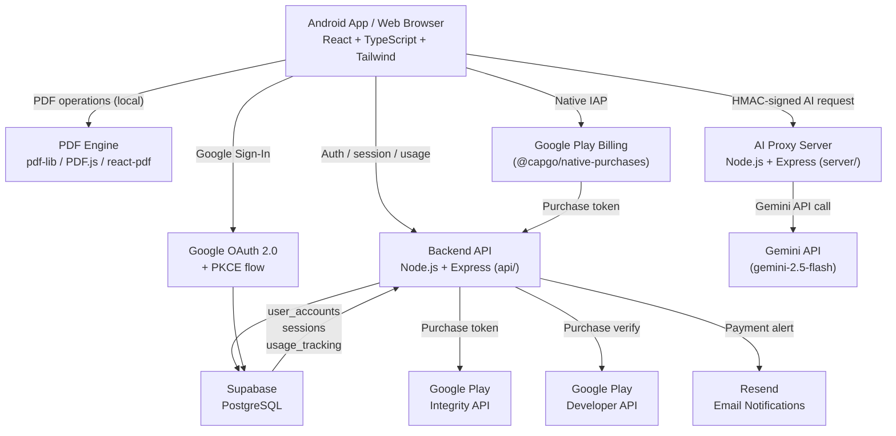

# Architecture — Anti-Gravity: Private AI PDF

## System Overview

Anti-Gravity is a privacy-first Android app (+ web PWA) built on React + Capacitor. Core PDF operations run locally in the browser. AI features route through a server-side proxy so the Gemini API key never reaches the client. Payments are verified server-side against Google Play before tier upgrades are written to Supabase.



## Core Decisions

### 1. Server-side AI proxy — key never reaches the client

All Gemini API calls go through `server/index.js`. The frontend sends HMAC-signed requests; the server validates the signature, appends the API key, and forwards to Gemini. Client builds never contain the API key. This is non-negotiable for Play Store compliance and user trust.

### 2. Local PDF processing first

`pdf-lib`, `PDF.js`, and `react-pdf` run inside the WebView via Capacitor. Merge, split, rotate, sign, watermark, page removal, and image conversion all process locally — no document is uploaded to a server for these operations. Only AI features (chat, summarize, extract, redact assist) send document content to the proxy, and only the relevant text excerpt is sent, not the full file.

### 3. IndexedDB queue for purchase retry

When a purchase completes on-device, the token is immediately persisted to an IndexedDB queue (`indexedDBQueue.ts`). The billing service retries server verification every 30 seconds for up to ~100 minutes. This survives network drops, app kills, and WebView crashes at purchase moment — the most failure-prone point in the flow.

### 4. Play Integrity for tamper detection

Android builds attach a Play Integrity token to AI and purchase requests. The backend validates the token before processing. This blocks sideloaded APKs and tampered builds from abusing the AI quota or forging purchases.

### 5. CSRF tokens on every session

`csrfService.ts` issues a short-lived CSRF token alongside the JWT session. Purchase verification, usage sync, and admin operations require a valid CSRF token. This prevents CSRF attacks on state-changing backend endpoints.

### 6. Lifetime pricing — no subscription engine

The billing model is a single one-time product (`lifetime_pro_access`). There is no subscription lifecycle, no renewal logic, no webhook for cancellations. This simplifies the backend to: verify token → write `tier = 'lifetime'` to Supabase → done. Reduces support surface and eliminates subscription churn as a metric.

### 7. Tier enforcement at the server, not the client

Usage limits are checked server-side on every AI request. The client UI reflects limits (TaskLimitManager) but the server does not trust client-reported tier. Every AI call re-validates the user's tier against Supabase before counting or processing.

## Key Files

| Path | Responsibility |
|---|---|
| `server/index.js` | Gemini AI proxy — HMAC validation, model fallback, rate limiting |
| `api/index.js` | Backend API — auth, purchase verification, usage sync, admin |
| `src/services/billingService.ts` | IAP flow, purchase queue, retry logic |
| `src/services/authService.ts` | JWT session management, CSRF sync, Google OAuth |
| `src/services/csrfService.ts` | CSRF token issue and validation |
| `src/services/integrityService.ts` | Play Integrity token fetch |
| `src/services/usageService.ts` | Usage fetch and sync |
| `src/services/apiService.ts` | `secureFetch` — signed request wrapper |
| `src/screens/AdminDashboard.tsx` | Nexus admin panel — payment recovery, user lookup |
| `android/app/build.gradle` | Version codes — update both versionCode + versionName per release |

## Data Model (Supabase)

```
user_accounts
  google_uid       TEXT PK
  tier             TEXT ('free' | 'lifetime')
  created_at       TIMESTAMP

usage_tracking
  google_uid       TEXT FK
  date             DATE
  ai_calls_used    INT
  last_updated     TIMESTAMP

sessions
  token            TEXT
  google_uid       TEXT FK
  expires_at       TIMESTAMP
  csrf_token       TEXT
```

## Deployment

- **Frontend + API routes:** Vercel (`api/index.js` → Vercel serverless functions)
- **AI proxy:** `server/index.js` runs as a separate Express server (self-hosted or Vercel)
- **Database:** Supabase hosted PostgreSQL
- **Android:** AAB signed in Android Studio → uploaded to Play Console

## Environment Variables

See `.env.example` for the full list. Critical ones:

| Var | Where used |
|---|---|
| `GEMINI_API_KEY` | `server/index.js` — never expose to client |
| `SUPABASE_SERVICE_ROLE_KEY` | `api/index.js` — server only |
| `GOOGLE_SERVICE_ACCOUNT_KEY` | `api/index.js` — Play Developer API |
| `VITE_AG_PROTOCOL_SIGNATURE` | Client → HMAC signing for proxy requests |
| `RESEND_API_KEY` | `api/index.js` — payment email alerts |
